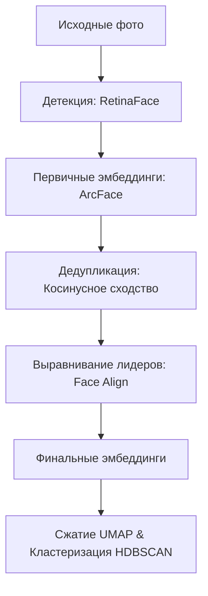

# FindFace

Интеллектуальная система управления фотоархивом на базе Streamlit и InsightFace.

## Возможности
- Детекция: Быстрый поиск лиц с помощью RetinaFace.
- Дедупликация: Автоматическое скрытие похожих кадров.
- Выравнивание: Приведение лиц к эталонному виду.
- Кластеризация: Группировка лиц по персонам (UMAP + HDBSCAN).

## Быстрый старт
1. Клонируйте репозиторий:
   ```bash
   git clone https://github.com/Divan1961/FaceManager.git
   ```
2. Установите зависимости:
   ```bash
   pip install -r requirements.txt
   ```

3. Укажите пути к папкам в 37 строке glanec.py

4. Запустите приложение:
   ```bash
   streamlit run glanec.py
   ```

## Технологии
- [Streamlit](https://streamlit.io)
- [InsightFace](https://github.com)
- [UMAP](https://readthedocs.io)
- [HDBSCAN](https://readthedocs.io)

## Архитектура пайплайна



### 1. Детекция & Сохранение KPS (RetinaFace)
Модель `RetinaFace` (в составе `InsightFace`) сканирует исходные кадры, локализует лица и извлекает **5 ключевых точек лица (KPS)**: глаза, нос и уголки рта. 
- **Оптимизация:** Точки `kps` и координаты `bbox` сразу сохраняются в локальную базу данных `faces_metadata.csv`. Это исключает необходимость повторного запуска нейросети на тяжелых исходных кадрах на последующих этапах.

### 2. Первичные эмбеддинги (ArcFace)
Каждое вырезанное лицо прогоняется через предобученную модель `ArcFace (buffalo_l)` для получения 512-мерного вектора признаков. Векторы нормализуются по L2-норме.

### 3. Дедупликация
На основе матрицы косинусного сходства (Cosine Similarity) система находит практически идентичные кадры (порог сходства > 0.98).
- Алгоритм разделяет лица на **«Лидеров»** и **«Свиту»**.
- «Свита» скрывается из интерфейса галереи Streamlit и привязывается к своему лидеру, увеличивая счетчик дубликатов. Это разгружает интерфейс и убирает сверхплотные «шумные» сгустки данных, которые ломают иерархическую кластеризацию.

### 4. Выравнивание лидеров (Face Align)
Для уникальных «лидеров» групп (а также для лиц, добавленных в папку вручную извне) запускается процесс геометрического выравнивания.
- Используя сохраненные на первом шаге координаты `kps`, алгоритм поворачивает и масштабирует изображение так, чтобы линия глаз была строго горизонтальной, а нос находился по центру (паспортный стандарт).
- **Для внешних лиц:** Скрипт автоматически применяет технику добавления полей (`copyMakeBorder`), что позволяет стабильно распознавать ключевые точки даже на сверхкрупных кропах.

### 5. Финальная векторизация и точная кластеризация (UMAP + HDBSCAN)
После выравнивания эмбеддинги для лидеров обновляются по их «идеальным» анфас-версиям. 
- **Снижение размерности (UMAP):** 512-мерные векторы проецируются в 5-мерное пространство с фокусом на косинусную метрику расстояний.
- **Группировка (HDBSCAN):** Алгоритм плотностного анализа выделяет устойчивые кластеры (персоны). По завершении кластеризации лидеры автоматически передают ID своих групп всем скрытым дубликатам.
